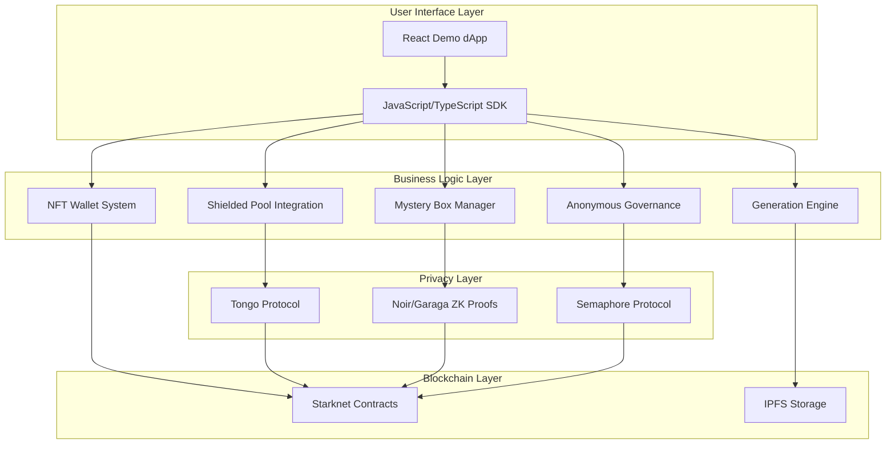

# Design Document: Kirito SDK

## Overview

The Kirito SDK is a comprehensive privacy-first toolkit for creating, minting, and managing yield-generating NFTs on Starknet. The system leverages cutting-edge privacy technologies including Tongo shielded pools, Noir/Garaga zero-knowledge proofs, and Semaphore anonymous signaling to create NFTs that function as smart wallets through account abstraction.

The architecture follows a modular design with five core components: Generation Engine, NFT Wallet System, Shielded Pool Integration, Mystery Box Manager, and Anonymous Governance. Each component is designed to work independently while integrating seamlessly with others to provide a complete privacy-focused NFT experience.

## Architecture

The Kirito SDK follows a layered architecture with clear separation between privacy, business logic, and user interface layers:



### Core Design Principles

1. **Privacy by Design**: All sensitive operations use zero-knowledge proofs or encryption
2. **Modularity**: Each component can be used independently or combined
3. **Upgradeability**: Smart contracts use UUPS proxy pattern for future improvements
4. **Interoperability**: Compatible with existing Starknet wallets and DeFi protocols
5. **Developer Experience**: Simple SDK interface with comprehensive documentation

## Components and Interfaces

### 1. Generation Engine

The Generation Engine creates unique NFT collections from image layers using a forked HashLips Art Engine with privacy enhancements.

**Core Interface:**
```typescript
interface GenerationEngine {
  generateCollection(config: GenerationConfig): Promise<CollectionMetadata>
  uploadToIPFS(images: ImageData[], metadata: MetadataSet): Promise<IPFSHashes>
  encryptHiddenTraits(traits: HiddenTraits, key: EncryptionKey): Promise<EncryptedData>
}

interface GenerationConfig {
  layers: LayerConfig[]
  rarityWeights: RarityConfig
  hiddenTraits?: HiddenTraitConfig
  collectionSize: number
  semaphoreGroupId?: string
}
```

**Key Features:**
- HashLips compatibility for layer processing
- IPFS integration for decentralized storage
- Hidden trait encryption for mystery boxes
- Rarity calculation with yield multipliers
- Semaphore group ID assignment for governance

### 2. NFT Wallet System

Each NFT functions as a smart wallet using Starknet's account abstraction (ERC-4337), enabling direct token storage and transfers.

**Core Interface:**
```typescript
interface NFTWallet {
  mint(recipient: Address, stakingAmount: bigint, metadata: TokenMetadata): Promise<TokenId>
  transfer(from: Address, to: Address, tokenId: TokenId): Promise<TransactionHash>
  executeTransaction(tokenId: TokenId, transaction: Transaction): Promise<TransactionHash>
  getBalance(tokenId: TokenId, asset: Address): Promise<bigint>
}

interface AccountAbstractionProxy {
  deployWallet(tokenId: TokenId): Promise<Address>
  validateTransaction(userOp: UserOperation): Promise<ValidationResult>
  executeUserOperation(userOp: UserOperation): Promise<TransactionHash>
}
```

**Implementation Details:**
- ERC-721 base contract with account abstraction extensions
- UUPS proxy pattern for upgradeability
- Integration with Argent X and Braavos wallets
- Stealth address generation for privacy
- Multi-signature support for enhanced security

### 3. Shielded Pool Integration

Integration with Tongo protocol provides privacy-preserving staking and yield distribution.

**Core Interface:**
```typescript
interface ShieldedPoolManager {
  deposit(amount: bigint, token: Address): Promise<ShieldedNote>
  withdraw(note: ShieldedNote, amount: bigint): Promise<TransactionHash>
  transfer(from: ShieldedNote, to: Address, amount: bigint): Promise<ShieldedNote>
  getShieldedBalance(note: ShieldedNote): Promise<EncryptedBalance>
}

interface YieldDistributor {
  calculateYield(tokenId: TokenId, period: TimePeriod): Promise<YieldAmount>
  distributeYields(recipients: TokenId[], amounts: YieldAmount[]): Promise<TransactionHash>
  claimYield(tokenId: TokenId, proof: ZKProof): Promise<TransactionHash>
}
```

**Privacy Features:**
- ElGamal encryption for hidden amounts
- Homomorphic operations for yield calculations
- Zero-knowledge proofs for eligibility verification
- Selective disclosure for compliance

### 4. Mystery Box Manager

Handles creation and revelation of mystery boxes with hidden traits and yields.

**Core Interface:**
```typescript
interface MysteryBoxManager {
  createMysteryBox(tokenId: TokenId, hiddenData: HiddenData): Promise<MysteryBox>
  setRevealConditions(boxId: BoxId, conditions: RevealConditions): Promise<void>
  revealTraits(boxId: BoxId, proof: ZKProof): Promise<RevealedTraits>
  verifyReveal(boxId: BoxId, proof: ZKProof): Promise<boolean>
}

interface ZKCircuitManager {
  generateRevealProof(secret: Secret, publicInputs: PublicInputs): Promise<ZKProof>
  verifyProof(proof: ZKProof, publicInputs: PublicInputs): Promise<boolean>
  compileCircuit(circuit: NoirCircuit): Promise<CompiledCircuit>
}
```

**Reveal Mechanisms:**
- Time-lock reveals based on block timestamps
- User-action triggers (staking thresholds, governance participation)
- Bluffing mechanics (prove trait category without revealing specific trait)
- Garaga on-chain verification for proof validation

### 5. Anonymous Governance

Semaphore-based anonymous signaling for collection governance.

**Core Interface:**
```typescript
interface AnonymousGovernance {
  createProposal(proposal: Proposal, groupId: GroupId): Promise<ProposalId>
  vote(signal: Signal, proof: SemaphoreProof): Promise<VoteId>
  verifyMembership(commitment: Commitment, groupId: GroupId): Promise<boolean>
  tallyVotes(proposalId: ProposalId): Promise<VoteResults>
}

interface SemaphoreManager {
  addMember(groupId: GroupId, commitment: Commitment): Promise<void>
  generateProof(identity: Identity, signal: Signal, groupId: GroupId): Promise<SemaphoreProof>
  verifyProof(proof: SemaphoreProof, signal: Signal, groupId: GroupId): Promise<boolean>
}
```

**Governance Features:**
- Anonymous voting on yield strategies
- Private signaling for reveal timing preferences
- Double-voting prevention through nullifier tracking
- Flexible proposal types (binary, multiple choice, weighted)

## Data Models

### Core Data Structures

```typescript
// NFT Metadata with Privacy Extensions
interface TokenMetadata {
  name: string
  description: string
  image: string
  attributes: Attribute[]
  yieldMultiplier: number
  rarityScore: number
  semaphoreGroupId?: string
  hiddenTraits?: EncryptedData
}

// Shielded Pool Note
interface ShieldedNote {
  commitment: Commitment
  nullifier: Nullifier
  encryptedAmount: EncryptedAmount
  tokenAddress: Address
  owner: PublicKey
}

// Mystery Box Structure
interface MysteryBox {
  tokenId: TokenId
  encryptedTraits: EncryptedData
  revealConditions: RevealConditions
  revealProof?: ZKProof
  isRevealed: boolean
}

// Governance Proposal
interface Proposal {
  id: ProposalId
  title: string
  description: string
  options: string[]
  groupId: GroupId
  deadline: Timestamp
  votingPower: VotingPowerType
}
```

### Database Schema

The system uses a hybrid approach with on-chain state for critical data and off-chain storage for metadata:

**On-Chain State:**
- NFT ownership and wallet addresses
- Shielded pool commitments and nullifiers
- Mystery box reveal status
- Governance proposal results

**Off-Chain Storage (IPFS):**
- NFT images and metadata
- Encrypted hidden traits
- Governance proposal details
- SDK documentation and examples

## Error Handling

### Error Categories

1. **Cryptographic Errors**: Invalid proofs, encryption failures, key generation issues
2. **Network Errors**: Starknet RPC failures, IPFS upload timeouts, wallet connection issues
3. **Business Logic Errors**: Invalid staking amounts, unauthorized operations, expired conditions
4. **Privacy Errors**: Proof verification failures, nullifier reuse, membership verification issues

### Error Recovery Strategies

```typescript
interface ErrorHandler {
  handleCryptographicError(error: CryptoError): Promise<RecoveryAction>
  handleNetworkError(error: NetworkError): Promise<RetryStrategy>
  handleBusinessLogicError(error: BusinessError): Promise<UserAction>
  handlePrivacyError(error: PrivacyError): Promise<SecurityAction>
}

enum RecoveryAction {
  RETRY_WITH_NEW_RANDOMNESS,
  REGENERATE_PROOF,
  FALLBACK_TO_PUBLIC_MODE,
  ABORT_OPERATION
}
```

### Graceful Degradation

- **Privacy Failures**: Fall back to public operations with user consent
- **Network Issues**: Queue operations for retry with exponential backoff
- **Proof Generation**: Provide alternative verification methods
- **Wallet Connectivity**: Support multiple wallet providers

## Testing Strategy

The testing strategy employs a dual approach combining unit tests for specific functionality and property-based tests for universal correctness properties.

### Unit Testing Approach

Unit tests focus on specific examples, edge cases, and integration points:

- **Component Integration**: Test interactions between Generation Engine and IPFS
- **Error Conditions**: Invalid inputs, network failures, cryptographic errors
- **Edge Cases**: Empty collections, maximum rarity values, expired conditions
- **Wallet Compatibility**: Integration with Argent X and Braavos wallets

### Property-Based Testing Framework

Property-based tests verify universal properties across randomized inputs using **fast-check** for JavaScript/TypeScript components and **Cairo testing framework** for smart contracts.

**Configuration:**
- Minimum 100 iterations per property test
- Each test tagged with: **Feature: kirito-sdk, Property {number}: {property_text}**
- Tests reference specific design document properties
- Comprehensive input generation covering edge cases

**Test Categories:**
1. **Cryptographic Properties**: Proof generation and verification correctness
2. **Privacy Properties**: Information leakage prevention and anonymity preservation  
3. **Business Logic Properties**: Yield calculations and distribution fairness
4. **Integration Properties**: Cross-component interaction correctness

### Testing Infrastructure

- **Starknet Foundry**: Smart contract testing with Cairo
- **Jest**: JavaScript/TypeScript unit and integration testing
- **fast-check**: Property-based testing for SDK components
- **Local Starknet**: Isolated testing environment
- **Mock Services**: IPFS, Tongo, and external oracle mocking

## Correctness Properties

*A property is a characteristic or behavior that should hold true across all valid executions of a system—essentially, a formal statement about what the system should do. Properties serve as the bridge between human-readable specifications and machine-verifiable correctness guarantees.*

The following properties define the correctness requirements for the Kirito SDK, derived from the acceptance criteria analysis. Each property is designed to be testable through property-based testing with comprehensive input generation.

### Property 1: NFT Generation Consistency
*For any* valid layer configuration and rarity settings, the Generation Engine should produce unique NFT combinations that respect the specified rarity distribution and include all required metadata fields (yieldMultiplier, rarityScore, semaphoreGroupId).
**Validates: Requirements 1.1, 1.3, 1.5**

### Property 2: IPFS Upload Completeness
*For any* generated NFT collection, all images and metadata should be successfully uploaded to IPFS and be retrievable using the returned hashes.
**Validates: Requirements 1.2**

### Property 3: Hidden Trait Encryption Round-Trip
*For any* hidden trait data, encrypting then decrypting with the correct key should produce the original trait data, while decryption with an incorrect key should fail.
**Validates: Requirements 1.4**

### Property 4: NFT Wallet Deployment
*For any* minted NFT, the system should deploy a functional wallet contract that can hold tokens, execute transfers, and maintain account abstraction compatibility.
**Validates: Requirements 2.1, 2.3, 6.5**

### Property 5: Shielded Staking Privacy
*For any* staking amount during minting, the Tongo protocol integration should hide the actual amount while maintaining the ability to prove stake eligibility for yield distribution.
**Validates: Requirements 2.2, 7.4**

### Property 6: Sealed-Bid Auction Integrity
*For any* set of sealed bids in an auction, the system should prevent bid revelation until the auction ends, then correctly determine the winner based on the revealed bids.
**Validates: Requirements 2.4**

### Property 7: Yield Distribution Proportionality
*For any* collection of NFTs with varying stakes and rarity scores, yield distribution should be proportional to the combination of shielded stake amount and rarity multiplier.
**Validates: Requirements 3.1, 3.2**

### Property 8: Zero-Knowledge Yield Claims
*For any* valid yield claim, the ZK proof should verify eligibility without revealing the claimant's balance or stake amount.
**Validates: Requirements 3.3, 7.3**

### Property 9: Multi-Source Yield Integration
*For any* combination of DeFi and RWA yield sources, the system should correctly aggregate yields and distribute them proportionally to eligible NFT holders.
**Validates: Requirements 3.4, 3.5**

### Property 10: Mystery Box Hiding Mechanism
*For any* mystery box with hidden traits, the traits should remain inaccessible until reveal conditions are met, at which point valid proofs should enable revelation.
**Validates: Requirements 4.1, 4.3**

### Property 11: ZK Reveal Proof Verification
*For any* mystery box reveal attempt, the Noir circuit should generate valid proofs for legitimate reveals and reject invalid attempts, with Garaga providing on-chain verification.
**Validates: Requirements 4.2, 4.5**

### Property 12: Bluffing Mechanism Privacy
*For any* hidden trait, the bluffing mechanism should allow proving trait category membership without revealing the specific trait value.
**Validates: Requirements 4.4**

### Property 13: Anonymous Governance Integrity
*For any* governance proposal, Semaphore should enable anonymous voting while preventing double-voting and maintaining verifiable vote tallies.
**Validates: Requirements 5.1, 5.3, 5.5**

### Property 14: Private Signaling Anonymity
*For any* governance signaling operation, voter identity should remain anonymous while ensuring only eligible holders can participate.
**Validates: Requirements 5.2, 5.4**

### Property 15: Cross-Network Deployment
*For any* smart contract deployment, the system should successfully deploy on both Starknet Sepolia testnet and mainnet with identical functionality.
**Validates: Requirements 6.2**

### Property 16: Stealth Address Privacy
*For any* private transfer, the system should generate unique stealth addresses that cannot be linked to the sender or receiver's primary addresses.
**Validates: Requirements 7.1**

### Property 17: Sensitive Data Encryption
*For any* sensitive data stored by the system, it should be encrypted using zero-knowledge proof systems and remain inaccessible without proper authorization.
**Validates: Requirements 7.2**

### Property 18: OpenZeppelin Security Compliance
*For any* deployed smart contract, it should follow OpenZeppelin security patterns and pass standard security checks.
**Validates: Requirements 7.5**

### Property 19: Proxy Contract Upgradeability
*For any* deployed collection contract, it should use the UUPS proxy pattern and support safe upgrades without losing state or functionality.
**Validates: Requirements 2.5**