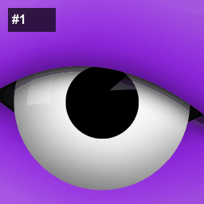

# Kirito Eye NFT Collection

## Overview
This collection contains 10 unique eye-themed NFTs generated using the Kirito SDK with privacy-enhanced features and yield generation capabilities.

## Generation Details
- **Generated**: 2/1/2026, 12:24:06 AM
- **Generation Time**: 2409ms
- **Success Rate**: 100.0%
- **Total Possible Combinations**: 324

## Collection Files
- `collection-thumbnail.gif` - Animated preview of all NFTs in the collection
- `collection-summary.json` - Complete collection statistics and metadata
- `README.md` - This documentation file

## Layer Structure
### Background
- **Black** (weight: 1)

### Bottom lid
- **High** (weight: 20)
- **Low** (weight: 40)
- **Middle** (weight: 40)

### Eye color
- **Cyan** (weight: 1)
- **Green** (weight: 1)
- **Pink** (weight: 1)
- **Purple** (weight: 1)
- **Red** (weight: 1)
- **Yellow** (weight: 10)

### Eyeball
- **Red** (weight: 50)
- **White** (weight: 50)

### Goo
- **Green** (weight: 1)

### Iris
- **Large** (weight: 20)
- **Medium** (weight: 20)
- **Small** (weight: 60)

### Shine
- **Shapes** (weight: 100)

### Top lid
- **High** (weight: 30)
- **Low** (weight: 20)
- **Middle** (weight: 50)

## Rarity Distribution
- **10-19**: 7 NFTs
- **20-29**: 3 NFTs

## File Structure
Each NFT folder contains:
- `original.png` - Full resolution (512x512)
- `large.png` - Large size (256x256)
- `medium.webp` - Medium size (128x128)
- `thumbnail.webp` - Thumbnail (64x64)
- `gif_preview.gif` - Animated preview (96x96)
- `metadata.json` - Complete metadata with attributes

## Features
- **Privacy-Enhanced**: Hidden traits can be encrypted
- **Yield Generation**: Rarity-based yield multipliers
- **Multiple Formats**: PNG, WebP, and animated GIF variants
- **HashLips Compatible**: Standard trait-based generation
- **Blockchain Ready**: IPFS-compatible metadata structure

## Usage
These NFTs are ready for:
1. IPFS upload and pinning
2. Smart contract minting
3. Marketplace listing
4. Yield farming integration
5. Privacy-enhanced trading

Generated with ❤️ using Kirito SDK
